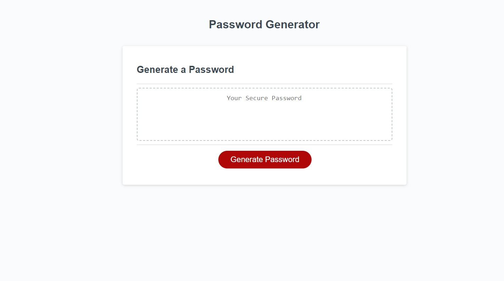

# unrealpasswordgenerator

## Description

This is a website so that people can generate new random passwords for use on whatever they need. This code allows you to create a password of you length choosing, and what chracters you want. During the creation of this I learnt how to do many Javascript things like creating loops and setting conditions so the website works as I want.

## Installation

Please clone the repo and open the HTML or clcik on the pages link found on the right of my repo

https://github.com/jarrettbutler/unrealpasswordgenerator

## Usage

Whe nyou click "Generate" options for the length show up as well as options for Upper, Lower case, numbers and special charcters. Depending on the input from the user the website will spit out a random password.

## License

Please see repo for license

## Tests
please generate clci kgenerate password top create a password, put in something that is outside 8-128 characters and open the log 